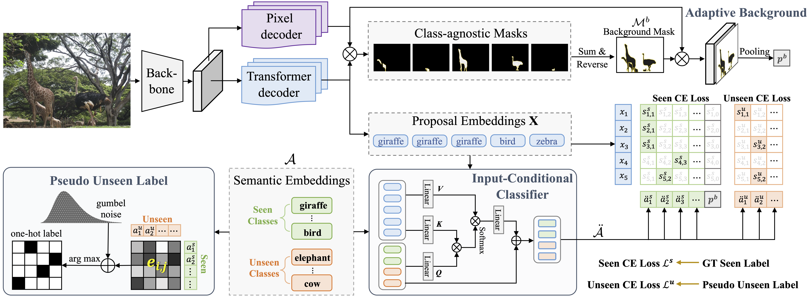

# Semantic-Promoted Debiasing and Background Disambiguation for Zero-Shot Instance Segmentation
[](https://pytorch.org/)
[](https://www.python.org/downloads/)

**[🏠[Project page]](https://henghuiding.github.io/D2Zero/)** &emsp; **[📄[arXiv]](https://arxiv.org/abs/2305.13173)**  &emsp; **[📄[PDF]](https://openaccess.thecvf.com/content/CVPR2023/papers/He_Semantic-Promoted_Debiasing_and_Background_Disambiguation_for_Zero-Shot_Instance_Segmentation_CVPR_2023_paper.pdf)**

This repository contains code for **CVPR2023** paper:
> [Semantic-Promoted Debiasing and Background Disambiguation for Zero-Shot Instance Segmentation](https://arxiv.org/abs/2305.13173) 
> Shuting He, Henghui Ding, Wei Jiang  




## Installation:

The code is tested under CUDA 11.2, Pytorch 1.9.0 and Detectron2 0.6.

1. Follow the installation process of  [Mask2Former](https://github.com/facebookresearch/Mask2Former)
3. Install other required packages: `pip -r requirements.txt`
4. Prepare the dataset following `datasets/README.md`

## Inference

GZSIS Settings:

```bash
python train_net.py  --config-file configs/d2zero_48_17.yaml --num-gpus 8 --eval-only MODEL.WEIGHTS d2zero_48_17/model_final.pth
```

ZSIS Settings:

```bash
python train_net.py  --config-file configs/d2zero_48_17.yaml --num-gpus 8 --eval-only MODEL.WEIGHTS d2zero_48_17/model_final.pth DATASETS.TEST '("coco_zsi_48_17_val_unseen_only",)' MODEL.MASK_FORMER.TEST.GENERALIZED False
```

## Training

```bash
python train_net.py  --config-file configs/d2zero_48_17.yaml --num-gpus 8
```

## Acknowledgement

This project is based on [ZSI](https://github.com/zhengye1995/Zero-shot-Instance-Segmentation), [Mask2Former](https://github.com/facebookresearch/Mask2Former). Many thanks to the authors for their great works!

## BibTeX
Please consider to cite D2Zero if it helps your research.

```latex
@inproceedings{D2Zero,
  title={Semantic-Promoted Debiasing and Background Disambiguation for Zero-Shot Instance Segmentation},
  author={He, Shuting and Ding, Henghui and Jiang, Wei},
  booktitle={CVPR},
  year={2023}
}
```

